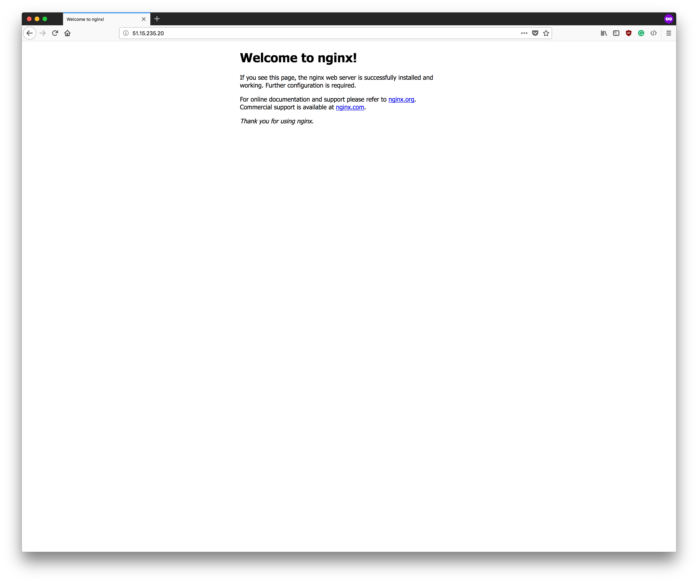

<!-- $theme: gaia -->
<!-- $size: a4 -->
<!-- template: invert -->

# Ansible Code Lab

<small>[Maxime Wojtczak](https://twitter.com/wjtzk) </small>
<small>[Antoine Barbare](https://twitter.com/antoine_geek)</small>

---

# Why Infrastructure as Code?

- Larger applications lead to larger deployments:
	- Repeated operations
	- Human errors
	- Tracability

---
# Why Infrastructure as Code?

- Cloud infrastructure

- Pet vs Cattle:
	- Elasticity
	- Disposable hosts

---
# Why Infrastructure as Code?

- Reduce infrastructure deployment costs:
	- More time on added-value rather than repeatition

- Deployment speed:
	- Automation leads to faster host availability

- Risk reduction:
	- Fewer manual operations leads to more reliable deployments
	- Automation increases the update rate

---
# Why Infrastructure as Code?

- Brings the code toolkit to infrastructure:
	- Ability to review changes
	- Reproductibility of a given infrastructure at a given time
	- Tracability

---
# Ansible

- Written in Python
- Extensible via modules and roles
- Push method
- Lightweight:
	- Only a SSH connection is required

---
# Ansible

- Mostly declarative
- YAML, YAML everywhere
	- Like it or hate it :)

---
# Principles

- Inventory:
	- Architecture definition
	- Group division

---
# Example

```ini
[webserver]
pweb01.yourcompany.com
pweb02.yourcompany.com

[middle]
pmiddle01.yourcompany.com
pmiddle02.yourcompany.com

[database]
pdb01.yourcompany.com
pdb02.yourcompany.com
pdb03.yourcompany.com

[database:vars]
mongodb_version=3.7.9
```
---
# Principles

- Playbook:
	- Link groups & hosts to roles

---
# Example

```yaml
- hosts: all
  roles:
    - certificates
    - node_exporter

- hosts: database
  roles:
    - mongodb

- hosts: webserver
  roles:
    - nginx
```

---
# Principles

- Roles:
	- Actual operations:
		- Services to install
		- Configurations to deploy
		- Operations to do

---
# Example
```yaml
- name: Ensure MongoDB APT key is declared
  apt_key:
    keyserver: keyserver.ubuntu.com
    id: 2930ADAE8CAF5059EE73BB4B58712A2291FA4AD5
    state: present

- name: Ensure MongoDB repository is present
  apt_repository:
    repo: deb http://repo.mongodb.org/apt/debian jessie/mongodb-org/3.6 main
    state: present

- name: Ensure MongoDB is installed
  apt:
    name: mongodb-org={{ mongodb_version }}
    state: present
```

---
# Example
```yaml
- name: Ensure MongoDB is configured
  template:
    src: mongod.conf.j2
    dest: /etc/mongod.conf
```
---
---
# Ansible Training

<small>Created by Antoine Barbare ([@antoine_geek](https://twitter.com/antoine_geek))</small>

---
# Agenda

- Couple of exercices

- Hands on Ansible
	- Deploy system pre-requites
	- Deploy application on remote system

- Advanced use of Ansible
	- Templating
	- Variable usage

---
# Technical environment

- 1 Ansible bastion
- 1 VM per user
- Access through SSH via login/password

**VM will be destroyed tonight. Code will be available on Github**

---
# Get your account
[https://huit.re/devops_lille_ansible](https://lite.framacalc.org/devops_lille_ansible)

Try your access to Ansible Bastion

```
user@laptop:~# ssh ansible<user_number>@ansible.barbare.me
```

Make sure you have access to your VM

```
ansible01@ansible:~# ssh ansible@ansible<user_number>
```

---
# Create your inventory file

Based on your user number, create your inventory file.
*You can take example on `/etc/ansible/hosts`*

Test your inventory file:

```
ansible01@ansible:~# ansible -i inventory all -m ping -b
master | SUCCESS => {
    "changed": false,
    "ping": "pong"
}
```
`-b` option will check the ability to switch root through `sudo`

---
# Deploying a simple app

We want to deploy devops web application on our VMs


---
# Deploying a simple app
Simple HTML landing page
Served via Nginx Web Server

*#TODO*
- Create a role to install Nginx web server
- Create a role to deliver our application
- Wrap up roles in a playbook
- Deliver on our server

---

# Nginx role

---
### Create your first role and playbook
- Install Nginx on the server
- Start and Enable Nginx at boot
- Wrap up your the role in a playbook

```
[ansible01@ansible ~]$ tree
.
├── inventory
├── playbook.yml
└── roles
    └── nginx_install
        └── tasks
            └── main.yml
```

Try: `ansible-playbook -i inventory playbook.yml`

---
### Solution
```
#roles/nginx_install/tasks/main.yml
---
- name: Install nginx daemon
  yum:
    name: nginx
    state: present
    update_cache: yes

- name: Start nginx and enable it at boot
  systemd:
    name: nginx
    state: started
    enabled: yes
```

---
### Solution
```
#playbook.yml
---
- name: Deploy devops app
  hosts: all
  become: yes
  roles:
    - nginx_install
```

---
**Check thaht nginx is installed and available**
`curl ansible<user_number>.barbare.me`



---

# Deploy app role

---
### Update your roles and playbook
```
[ansible01@ansible ~]$ tree
.
├── inventory
├── playbook.yml
└── roles
    ├── deploy_app
    │   ├── files
    │   │   ├── nginx.conf
    │   │   └── nginx-devops.conf
    │   ├── handlers
    │   │   └── main.yml
    │   └── tasks
    │       └── main.yml
    └── nginx_install
        └── tasks
            └── main.yml
```
Try: `ansible-playbook -i inventory playbook.yml`


---
# Deploying application
Devops App resources are available online:
- https://github.com/antoineHC/ansible-meetup-app
- https://github.com/antoineHC/ansible-meetup-nginx

ansible-meetup-app => `/usr/share/nginx/html/ansible-meetup-app/`

`nginx.conf` => `/etc/nginx/nginx.conf`
`nginx-devops.conf` => `/etc/nginx/conf.d/app.conf`

*Don't forget to restart nginx after deploy your app*

---
### Solution
```
#roles/deploy_app/tasks/main.yml
---
- name: deploy devops app from github
  git:
    repo: https://github.com/antoineHC/ansible-meetup-app
    dest: /usr/share/nginx/html/ansible-meetup-app

- name: update nginx conf
  copy:
    src: nginx.conf
    dest: /etc/nginx/nginx.conf
  notify: restart nginx

- name: update nginx devops conf
  copy:
    src: nginx-devops.conf
    dest: /etc/nginx/conf.d/devops.conf
  notify: restart nginx
```

---
### Solution
```
#roles/deploy_app/handlers/main.yml
---
- name: restart nginx
  systemd:
    name: nginx
    state: restarted
  listen: restart nginx
```
```
#playbook.yml
---
- name: Deploy devops app
  hosts: all
  become: yes
  roles:
    - nginx_install
    - deploy_app
```

---
# Check our your app online


---
# Success !


# Best practices

- Variables
	- Variables may be declared about anywhere
	- Keep it simple and well organized, better stick to:
		- Inventory
		- Roles' defaults
		- Roles' vars

# Best pratices

- Roles
	- Tasks can be defined at the playbook level
	- Prefer roles to keep things well organized

# Best practices

- Playbook is not scripting
	- Dependent tasks is OK from time to time
	- When it gets more complicated, consider writing a proper module
		- Simple Python, better for tests, readability, and advanced features (check mode, etc.)

# Go further

- Ansible Tower
- AWX (Tower upstream)
